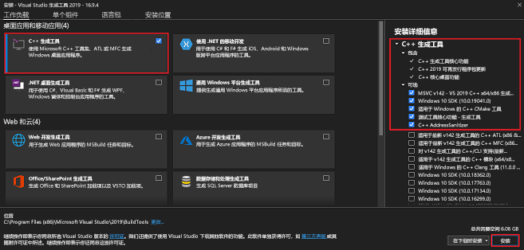

# 安装Rust

## Windows 安装 Rust
### 第一步：安装 Visual C++ 生成工具 (必须安装，如果有请看第二步)
Rust 需要 Visual Studio 2013 或更高版本的 Microsoft C++ 生成工具。 必须先安装这些编译工具，然后才能安装 Rust。

如果尚未安装编译工具，请执行以下步骤：

1. 转到[Visual Studio Code 下载页面](https://visualstudio.microsoft.com/zh-hans/visual-cpp-build-tools/)。
2. 选择“**下载生成工具**”。
3. 下载完成后，运行安装程序文件。 系统会打开 Visual Studio 安装程序窗口。
4. 在弹出窗口中，选择“**是**”。 在下一个弹出对话框中，选择“继续”。
5. 在安装程序窗口中的“**桌面设备和移动电话**”下，选中左侧“**C++ 生成工具**”选项的复选框。
6. 在右侧的“ Visual Studio Code 下载页面”窗格中，确保选中以下选项：


1. 在右下角，选择“安装”。

安装完成后，可以继续安装 Rust。
### 第二步： 安装 Rust

安装 Rust 的建议方法是使用 Rust 工具链安装程序 `rustup` 。 请到网站 [rustup.rs](https://rustup.rs/) 查找操作系统的相应说明。

在 Linux 或 macOS 上，通过选择剪贴板图标来复制 curl 命令。 然后，打开你的计算机的终端或命令提示符以粘贴该命令，然后按照屏幕上的说明进行操作。 在 Windows 上，按照安装程序中的说明操作。

Rust 有一个为期六周的快速发布过程，并且支持大量的平台，因此随时都有许多版本的 Rust 可用。 如果你以前安装了 `rustup` ，则可通过运行 `rustup update` 命令更新到 Rust 的最新稳定版本。

具体安装了cargo，clippy，rust-docs，rust-std，rustc，rustfmt：
- cargo是程序和包管理器
- clippy是优化检查器
- rust-docs是官方文档
- rust-std是标准库
- rustfmt是自动格式化
- miri是MIR代码解释器
- rustup是rust基础设施命令工具
- rust-gdb是调试器
如图：


### 第三步：检查 Rust 安装
检查系统环境变量 `PATH` ，如果没有就添加
> windows 示例: C:\Users\xxx\.cargo\bin


完成 Rust 安装后，应该就可以使用 rustc 和 cargo 命令。

在终端或命令提示符下运行以下命令：
```sh
rustc --version
```

应当会看到与以下示例类似的输出：
```sh
rustc 1.58.0 (02072b482 2022-01-11)
```

然后，运行以下命令：
```sh
cargo --version
```

此时会看到与下面类似的输出：
```sh
cargo 1.58.0 (7f08ace4f 2021-11-24)
```

这两个输出行都包含以下有关可用 Rust 和 Cargo 的最新稳定版本的信息：
- 发行版号
- 提交哈希
- 提交日期
  
该信息显示为以下格式：
> <executable-name> <three-part-release-number> (<9-character-hash-code> <4-digit-year>-<2-digit-month>-<2-digit-day>)

如果看到此类型的输出，则这两个安装都成功。 如果看不到此信息，请检查你的 `PATH` 环境变量。 请确保它包含具有 `rustc.exe` 和 `cargo.exe` 可执行文件的文件夹。


参考：
- https://blog.csdn.net/kevinyankai/article/details/104459118