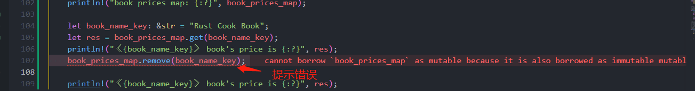
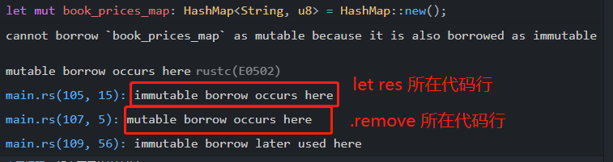

# 使用哈希映射
Rust 中还有一种常见的集合类型是哈希映射。 `HashMap<K, V>` 类型通过映射每个键 `K` 及其值 `V` 来存储数据。 向量中的数据通过整数索引进行访问，而哈希映射中的数据通过键进行访问。

哈希映射类型在数据项（例如对象、哈希表和字典）的多种编程语言中使用。

与向量一样，哈希映射大小可以增加。 **数据存储在堆中，并在运行时检查对哈希映射项的访问**。

## 定义HashMap
以下示例定义了一个`HashMap` 。`key` 键为书名，`value`值为书的价格。
```rust
use std::collections::HashMap

let mut book_prices_map:HashMap<String,u8> = HashMap::new();

book_prices_map.insert(String::from("Rust Cook Book"), 1);
book_prices_map.insert(String::from("Go Cook Book"), 2);

// book_prices_map:  {"Go Cook Book": 2, "Rust Cook Book": 1}
```
让我们更仔细地查看这段代码。 第一行显示了一种新的语法：
```rust
use std::collections::HashMap;
```
`use` 命令将 Rust 标准库的 `collections` 部分中的 `HashMap` 定义引入到程序范围内。 这种语法类似于其他编程语言所述的导入。

使用 `HashMap::new` 方法创建空的哈希映射。 将 `book_prices_map` 变量声明为**可变变量**，因此可以根据需要添加或删除键和值。 在示例中，哈希映射键为 `String` 类型、值为 `u8` 类型
```rust
let mut book_prices_map:HashMap<String,u8> = HashMap::new();
```
## 添加键值对
使用 `insert(<key>, <value>)` 方法向哈希映射添加元素。 在代码中，语法为 `<hash_map_name>.insert()`：
```rust
book_prices_map.insert(String::from("Rust Cook Book"), 1);
```

## 获取键值
将数据添加到哈希映射后，便可使用 `get(<key>)` 方法获取**键**的特定值。
```rust
let book_name_key: &str = "Rust Cook Book";
let res = book_prices_map.get(book_name_key);
println!("《{book_name_key}》 book's price is {:?}", res)
```
输出：
```sh
《Rust Cook Book》 book's price is Some(1) 
```
> 注意：
> 
> 输出结果中，将数的价格显示为“Some(1)”，而不仅仅是“1”。 由于 `get` 方法返回 `Option<&Value>` 类型，因此 Rust 使用“`Some()`”表示法**包装方法调用的结果**。

## 删除键值对
可以使用 `.remove()` 方法从哈希映射中删除条目。 

```rust
book_prices_map.remove(book_name_key);
```
但是IDE已经在提示我们代码存在问题


鼠标浮上去后具体显示内容如下：



大意就是我们的代码改变了 `book_prices_map`的可变性，具体就是以下代码：
```rust
let res = book_prices_map.get(book_name_key);
```
这行代码有个隐蔽的“坑”，直观逻辑是想获取 `book_prices_map` 的 value，该value我们是不会更改的的，所以通过 `let res` 来声明了返回值。

但是这样做会改变 `book_prices_map` 的可变性，也就是说 `book_prices_map` 从 `mutable` 变为了 `immutable`，即 `可变` -> `不可变`。

既然已经不可变了，那么我们在执行 `remove()` 函数去删除元素就报错了，同样执行 `insert()` 也会报错:
```rust
book_prices_map.insert(String::from("Rust Cook Book"), 222);
```
如何调整我们的代码呢？ 

`book_prices_map.get(book_name_key)` 的返回值我们直接使用，不用新 `let` 一个变量来承载:
```rust
`println!("《{book_name_key}》 book's price is {:?}", book_prices_map.get(book_name_key));`
```


另外，如果对无效的哈希映射键使用 `get` 方法，则 `get` 方法会返回“`None`”。
```rust
 book_prices_map.remove(book_name_key);

println!(
    "《{book_name_key}》 book's price is {:?}",
    book_prices_map.get(book_name_key)
);
```

输出：
```rust
《Rust Cook Book》 book's price is None
```